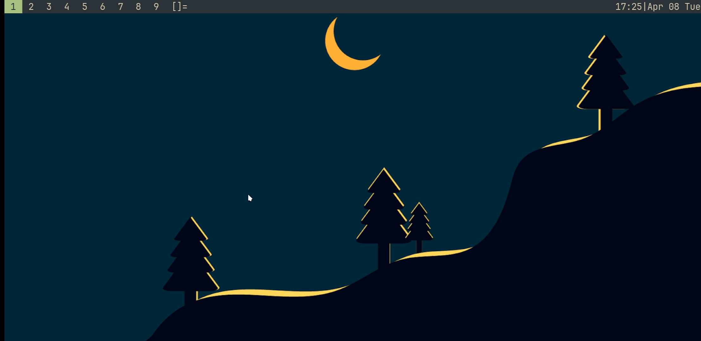
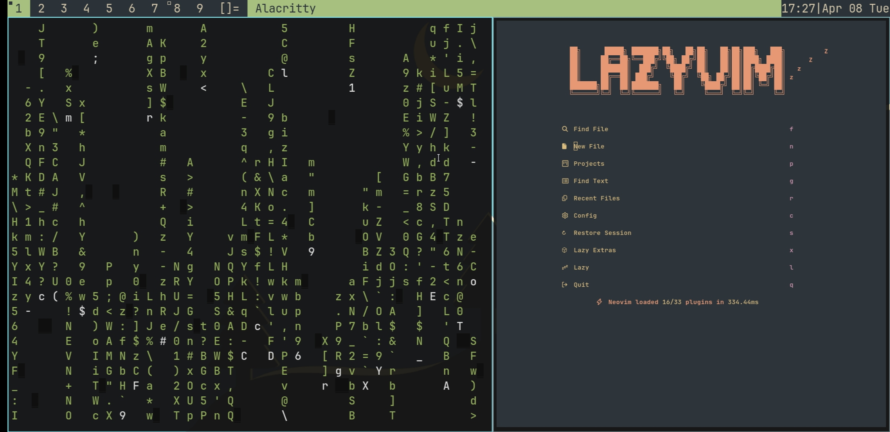

# **Termux-mdwm** #
:fire: *a simple and lightweight config for dwm with gpu acceleration in termux*   

## *PREVIEW* ##




### **INSTRUCTIONS** ###
***for setting up the environment you need following requirements:***
- [x] termux app.
*Link:(https://github.com/termux/termux-app/releases/tag/v0.118.2)*  
>:warning:  **only use github or fdroid as playstore one is outdated**
- [x] **termux:x11** . 
*Link:(https://github.com/termux/termux-x11/releases/tag/nightly)*
- [x] **termux:api** .
*Link: (https://github.com/termux/termux-api/releases/tag/v0.51.0)*
- [x] **internet connection**

### first step ###
*first update the system and install git  by running following command*
```bash
apt update -y && apt upgrade -y  && apt install git -y && termux-setup-storage
```
> *CLICK ON ALLOW WHILE SETTING UP STORAGE*
### second step ###
**clone the repo and run install.sh**
```bash
git clone https://github.com/BayonetArch/termux-mdwm.git 
cd termux-mdwm
./install.sh
```


## **That's it you have succesfully installed the desktop** ##
*run the desktop by running*
```bash
start
```

## Need Help?

If you run into any issues or have questions, feel free to ask in the comments on my [YouTube channel](https://www.youtube.com/@Bayonet7). I’ll try to respond as soon as I can.


